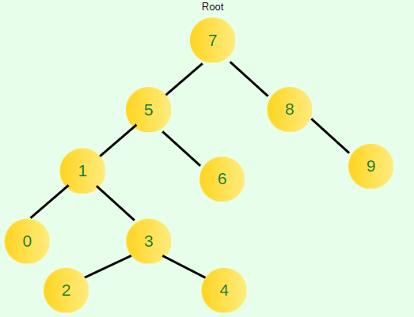

# Proje 3
[7, 5, 1, 8, 3, 6, 0, 9, 4, 2] dizisinin Binary-Search-Tree aşamalarını yazınız.

Örnek: root x'dir. root'un sağından y bulunur. Solunda z bulunur vb.

# Cevap:

Root 7 dir.
Sıra ile dizide gezip büyükleri sağa küçükler sola şeklinde yerleştirme yapacağız.

- Root 7. 5<7 olduğu için sol tarafına yazılır.
- 1 hem 7 den küçük hem 5 den. en sola yazdık.
- 8>7 olduğu için sağa yazdık.
- 3 sayısı 7 ve 5 den küçük ama 1 den büyük. 1'in sağına yazdık
- 6<7 ve 6>5 olduğu için 5 in sağına yazdık.
- 0 en küçük. en sola yazdık.
- 9 en büyük en sağa yazdık.
- 4'ü 7 ve 5'in soluna,1 ve 3'ün sağına yazdık.
- 2'yi 3'ün soluna yazdık

## Oluşan Son Durum

